# Guidance for Secure Access to External Package Repositories on AWS

## Table of Contents

1. [Overview](#overview)
    - [Demo Recording](#demo-recording)
    - [Solution Architecture](#solution-architecture)
    - [Cost](#cost)
2. [Prerequisites](#prerequisites)
    - [Operating System](#operating-system)
    - [Multi-Account Configuration](#multi-account-configuration)
    - [Required Permissions](#required-permissions)
    - [Run Security Scan on the AWS CloudFormation Template](#optional-run-security-scan-on-the-aws-cloudFormation-template)
3. [Deployment Steps](#deployment-steps)
    - [Fork and Clone the Repository](#fork-and-clone-the-repository)
    - [Configure VPC Networking](#configure-vpc-networking)
    - [Create GitHub Personal Access Token](#create-github-personal-access-token)
    - [Collect Private Internal Source Code Repository Configuration](#collect-private-internal-source-code-repository-configuration)
    - [Deploy AWS CloudFormation Stack](#deploy-aws-cloudformation-stack)
4. [Deployment Validation](#deployment-validation)
5. [Running the Guidance](#running-the-guidance)
6. [Next Steps](#next-steps)
7. [Clean Up](#clean-up)

## Overview

This solution demonstrates the deployment of AWS Code Services, including [AWS CodePipeline](https://docs.aws.amazon.com/codepipeline/latest/userguide/welcome.html), [AWS CodeBuild](https://docs.aws.amazon.com/codebuild/latest/userguide/welcome.html),  [Amazon CodeGuru Security](https://docs.aws.amazon.com/codeguru/latest/security-ug/what-is-codeguru-security.html), and [AWS CodeArtifact](https://docs.aws.amazon.com/codeartifact/latest/ug/welcome.html)), to streamline the process for data scientists to access external packages while ensuring Information Security (InfoSec) compliance. Through an automated AWS CodePipeline orchestration, external packages undergo Amazon CodeGuru Security scans such as static application security testing, software composition analysis, dynamic code analysis, and image vulnerability scanning. Data scientists are notified of their external package security finding results through email using [Amazon Simple Notification Service](https://docs.aws.amazon.com/sns/latest/dg/welcome.html) (SNS). InfoSec-approved external packages are added to a private internal AWS CodeArtifact package repository. Data scientists access approved packages from their private Jupyter Notebook environments, such as [Amazon SageMaker](https://docs.aws.amazon.com/sagemaker/latest/dg/whatis.html). Importantly, InfoSec governance controls are seamlessly integrated to maintain a smooth data science workflow experience without disruptions. Additionally, the solution can be extended to accommodate general developer workflows, where developers utilize external packages.

This solution addresses three primary objectives:
1. Provisioning a self-service workflow for data scientists to request access to external packages.
2. Automating orchestration of security scanning for external package repositories.
3. Establishing and maintaining an InfoSec-compliant private internal package repository.

### Demo Recording

The following demo recording highlights external package security scanning workflow functionality and technical implementation details.

[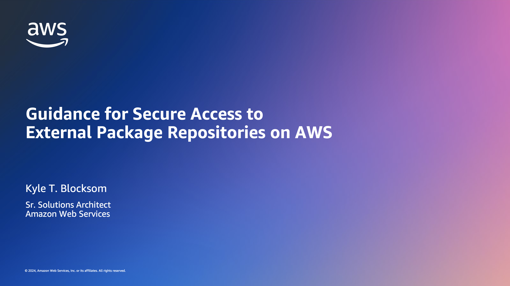](https://www.youtube.com/watch?v=s_jMRs8yUQE "Guidance for Secure Access to External Package Repositories on AWS - YouTube")

### Solution Architecture

The following diagram illustrates the solution architecture.

<p align="center">
  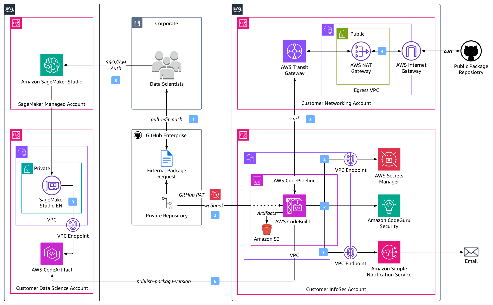<br>
  <span style="display: block; text-align: center;"><em>Figure 1: External Package Repository Security Scanning Architecture</em></span>
</p>

The workflow consists of the following steps:

**1 – Data Scientist Self-Service Model**  
Data scientists pull the current version of the [external-package-request.csv](external-package-request.csv) file from the private internal GitHub repository, append desired additional external package repositories to the request file, then push the updated request file back to the private internal repository.

**2, 3 – External Package Ingest**  
AWS CodePipeline orchestration is triggered by a token-authenticated webhook linked to the private internal GitHub repository containing the external package request file. Within the pipeline, an AWS CodeBuild project is utilized to download the external package repositories. Downloaded files are stored as CodePipeline artifacts in [Amazon Simple Storage Service](https://docs.aws.amazon.com/AmazonS3/latest/userguide/Welcome.html) (S3).

**4 – Infrastructure Security**  
Centralized Internet egress occurs through a [NAT Gateway](https://docs.aws.amazon.com/vpc/latest/userguide/vpc-nat-gateway.html) (NGW) attached to the egress [Virtual Private Cloud](https://docs.aws.amazon.com/toolkit-for-visual-studio/latest/user-guide/vpc-tkv.html) (VPC) in the Customer Networking Account, reducing costs associated with a distributed model where NGWs are deployed in every spoke VPC. The [Elastic IP](https://docs.aws.amazon.com/AWSEC2/latest/UserGuide/elastic-ip-addresses-eip.html) (EIP) of the NGW provides customers with a static IP address that they can include in their firewall ruleset or allow-list for private network egress.

**5 – Automated Security Scanning**  
Once the external package repositories are downloaded, the AWS CodeBuild project runs [Amazon CodeGuru Security security scans](https://docs.aws.amazon.com/codeguru/latest/security-ug/how-codeguru-security-works.html).

**6, 7 – Security Results and Private Internal Package Repository Management**  
Data scientists are notified of their security finding results, however, only InfoSec-approved packages are published to the private internal AWS CodeArtifact (or GitHub) package repository. For InfoSec-refused external packages with medium or higher severities, data scientists are provided with Amazon CodeGuru Security finding details for further investigation.

**8, 9 – MLOps Workflow**  
Within their Amazon SageMaker Studio Notebooks, data scientists install InfoSec-approved packages from the private internal AWS CodeArtifact package repository.

### Cost

You are responsible for the cost of the AWS services used while running this Guidance. As of March 2024, the cost for running this Guidance with the default settings in the US East (N. Virginia) AWS Region is approximately $19.575 per month based on the following assumptions.

- Pipeline execution frequency - AWS CodePipeline execution occurs 100 times per day for external package scans.
- Package size - Moderate-sized packages are being security scanned with an average AWS CodeBuild build time of 10 minutes.
- Storage requirements - 100GB for AWS CodePipeline artifacts and 50GB for the AWS CodeArtifact private internal package repository.
- Compute resources - Default compute configuration for AWS CodeBuild.

**AWS CodeArtifact ([Pricing](https://aws.amazon.com/codeartifact/pricing/)):**
> Storage: 
  > - 50GB for packages
  > - Free tier includes 2GB of storage every month.
  > - Additional storage needed: 48GB.
  > - Cost per GB / Month: $0.05 per GB. 
> 
> Estimated monthly cost for 48GB storage: $0.05 per GB * 48GB = $2.40
> 
> Data Transfer Out: N/A
>
> Requests: 
  > - Assuming minimal requests, estimate 10,000 requests per month.
  > - Free tier includes first 100,000 requests every month.

Estimated monthly cost: $2.40

**AWS CodeBuild ([Pricing](https://aws.amazon.com/codebuild/pricing/)):**
> - Build duration per execution: 10 minutes
> - Number of build minutes per month: 3000
> - Free tier includes 100 build minutes per month.
> - Additional build minutes needed: 3000 - 100 = 2900 build minutes  
> - Cost per build minute, assuming default build environment: $0.005 
 
Estimated monthly cost: $0.005 build/minute × 2900 minutes = $14.50

**Amazon CodeGuru Security ([Pricing](https://aws.amazon.com/codeguru/pricing/)):**
> - As of February 2024, CodeGuru Security is available for free in public preview.

Estimated monthly cost: $0

**AWS CodePipeline ([Pricing](https://aws.amazon.com/codepipeline/pricing/)):**
> - Number of active pipelines: 1
> - Free tier includes 1 active pipeline per month.
> - Each pipeline thereafter is $1 per month. 

Estimated monthly cost: $0 

**Amazon S3 ([Pricing](https://aws.amazon.com/s3/pricing/)):**
> Storage: 
  > - 100GB for artifacts
  > - Free tier includes 5GB of standard storage.
  > - Additional storage needed: 95GB.
  > - Standard storage pricing for Amazon S3 outside of the free tier is typically $0.023 per GB-month for the first 50TB tier.  
>
> Estimated monthly cost for 95GB storage: $0.023/GB-month * 95GB = $2.185
>
> Data Transfer Out: N/A
>
> Requests: 
  > - Assuming minimal requests, estimate 10,000 requests per month.
  > - Free tier includes 20,000 GET requests and 2000 PUT, COPY, POST, or LIST requests per month.
  > - Additional requests needed: 8000.
  > - Request pricing varies depending on the type of request and region. For standard Amazon S3 requests, it is typically around $0.005 per 1000 requests.
>
> Estimated monthly cost for 8000 requests: $0.005 per 1000 requests * (8000 requests / 1,000) = $0.04

Estimated monthly cost: $2.185 + $0.04 = $2.225

**Amazon Simple Notification Service ([Pricing](https://aws.amazon.com/sns/pricing/)):**
> - Assuming 30,0000 notifcation deliveries for each pipeline execution per month.
> - Free tier includes:
>   - One million publishes per month for the first 12 months, starting from the date of sign-up.
>   - 100,000 HTTP/HTTPS deliveries, email deliveries, email deliveries to Amazon SES and Amazon Pinpoint, and SMS deliveries per month for the first 12 months.

Estimated monthly cost: $0

**AWS Secrets Manager ([Pricing](https://aws.amazon.com/secrets-manager/pricing/)):**
> - Number of Secrets Stored: 1 (personal access token)
> - $0.40 per secret per month.
> - $0.05 per 10,000 API calls.

Estimated monthly cost: $0.40 + $0.05 = $0.45

Please note that the actual cost will depend on factors such as the frequency of pipeline executions, the size, complexity, and number of packages being scanned, and the amount of data stored in Amazon S3 and AWS CodeArtifact.

## Prerequisites

### Enable Amazon CodeGuru Security

In June 2023, AWS announced the preview release of Amazon CodeGuru Security, a static application security testing (SAST) tool that uses machine learning to identify code vulnerabilities. 

This solution utilizes Amazon CodeGuru Security scans on external packages to provide guidance for addressing vulnerabilities and offering in-context code patches for specific vulnerability categories, simplifying the remediation process.

Before deploying the solution, ensure that Amazon CodeGuru Security is enabled for the region where you intend to deploy the solution stack.

Amazon CodeGuru Security is accessible through the AWS Management Console, the [AWS Command Line Interface](https://aws.amazon.com/cli/) (CLI), and [AWS Software Development Kit](https://aws.amazon.com/developer/tools/) (SDK), along with several integrations. For additional information, refer to [Getting started with CodeGuru Security](https://docs.aws.amazon.com/codeguru/latest/security-ug/getting-started-with-codeguru-security.html).

### Operating System

You must have AWS CLI installed. For installation instructions, refer to [Installing, updating, and uninstalling the AWS CLI](https://docs.aws.amazon.com/cli/latest/userguide/cli-chap-install.html).

### Multi-Account Configuration

The preceding Figure 1 diagram highlights a multi-account structure where functional teams are isolated by the security, access, and billing boundaries of their AWS account. This is a proposed multi-account structure that can be adapted for your specific requirements, organizational and governance structure, and project methodology.

The AWS Whitepaper for [Building a Secure Enterprise Machine Learning Platform](https://docs.aws.amazon.com/whitepapers/latest/build-secure-enterprise-ml-platform/aws-accounts.html) recommends production data science environments use multiple AWS accounts for the following benefits:
- Group workloads based on business purpose and ownership
- Apply distinct security controls by environment
- Limit scope of impact from adverse events
- Improve cost visibility and control
- Restrict access to sensitive data

This solution can be expanded upon to follow a multi-account approach by deploying separate AWS CloudFormation stacks into each respective account:
- **Customer Data Science Account:** Contains an Amazon SageMaker Studio domain for data science teams. This account is used by data scientists and ML engineers to perform experimentation and development.
- **Customer Networking Account:** Isolates the networking services, configuration, and operation from the individual applications, security, and other infrastructure. 
- **Customer InfoSec Account:** Operates security services, monitors AWS accounts, and automates security alerting and response.

The preceding multi-account structure can be further sub-divided. Each of these account groups can have multiple AWS accounts per environment for development and testing of services and storing different data classifications.

❗ For production environments, AWS recommends the use of two additional account groups:
- **Shared Services Account:** Hosts common resources like team code repositories, CI/CD pipelines for MLOps workflows, Docker image repositories, Amazon SageMaker model registries, and [AWS Service Catalog](https://docs.aws.amazon.com/servicecatalog/latest/adminguide/introduction.html) product portfolios. 
- **Data Management Account:** Stores and manages all data for the MLOps process with strong data security and governance practices using [AWS Data Lake](https://aws.amazon.com/solutions/implementations/data-lake-solution/) and [AWS Lake Formation](https://aws.amazon.com/lake-formation/).

### Required Permissions

By default, AWS CloudFormation uses a temporary session that it generates from your [AWS Identity and Access Management](https://docs.aws.amazon.com/sagemaker/latest/dg/security-iam.html) (IAM) credentials for stack operations. If you specify a service role, AWS CloudFormation will instead use that role's credentials.

To deploy this solution, your AWS IAM user/role or service role must have permissions to deploy the resources specified in the AWS CloudFormation template. For more details on IAM with CloudFormation, refer to the [AWS CloudFormation User Guide](https://docs.aws.amazon.com/AWSCloudFormation/latest/UserGuide/using-iam-template.html). #TODO: Could include the specific IAM actions necessary to deploy the solution

### (OPTIONAL) Run Security Scan on the AWS CloudFormation Template

To run a security scan on the AWS CloudFormation template using [`cfn_nag`](https://github.com/stelligent/cfn_nag) (recommended), install `cfn_nag`:
```sh
brew install ruby brew-gem
brew gem install cfn-nag
```

To initiate the security scan, run the following command:
```sh
git clone https://github.com/aws-solutions-library-samples/guidance-for-secure-access-to-external-package-repositories-on-aws.git
cd guidance-for-secure-access-to-external-package-repositories-on-aws/cfn/
cfn_nag_scan --input-path ./codeartifact-private-repo.yaml
```

## Deployment Steps

The following workflow diagram illustrates the end-to-end deployment process outlined in this guide.

<p align="center">
  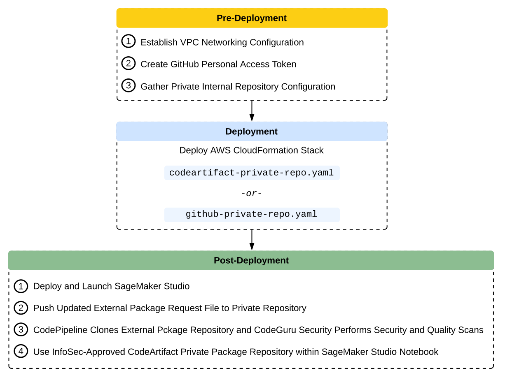<br>
  <span style="display: block; text-align: center;"><em>Figure 2: Solution Deployment Workflow</em></span>
</p>

### Fork and Clone the Repository

Follow [GitHub's instructions](https://docs.github.com/en/get-started/quickstart/fork-a-repo?tool=webui&platform=mac) to fork this repository. This action creates a copy of the repository that is disconnected from the original codebase, allowing you to make necessary modifications.

Create a local copy of the forked repository using _git clone_:

```sh
git clone <YOUR-FORKED-REPOSITORY-URL>
```

### Configure VPC Networking

Private VPC networking ensures that resources are isolated from the public internet by default. This reduces the attack surface and minimizes the risk of unauthorized access from external sources. By deploying resources within private subnets, access to these resources can be tightly controlled. Access can be restricted to only specific IP ranges or other AWS resources within the same VPC, reducing the risk of unauthorized access.

This solution requires private VPC subnets into which you can deploy AWS CodeArtifact, AWS CodeBuild, AWS CodePipeline, AWS Secrets Manager, and Amazon SNS [VPC Endpoints](https://docs.aws.amazon.com/whitepapers/latest/aws-privatelink/what-are-vpc-endpoints.html). These subnets must be within a VPC that is also configured with an NGW in a public subnet to facilitate Internet ingress and egress through an IGW for downloading external package repositories.

If your environment lacks the required VPC setup, use the provided [VPC CloudFormation template](https://github.com/awsdocs/aws-lambda-developer-guide/blob/master/templates/vpc-privatepublic.yaml) to create them. After deploying the VPC, note the VPC ID and the IDs of the private subnets. These identifiers are required parameters in the Deploy AWS CloudFormation Stack section.

### Create GitHub Personal Access Token

To authenticate with your private internal GitHub repository, generate a [personal access token](https://docs.github.com/en/authentication/keeping-your-account-and-data-secure/managing-your-personal-access-tokens) (PAT). You may prefer to use a [GitHub App](https://docs.github.com/en/apps/creating-github-apps/creating-github-apps/about-apps) to access resources on behalf of an organization or for long-lived integrations. To create your PAT, follow GitHub's instructions for [creating a personal access token (classic)](https://docs.github.com/en/authentication/keeping-your-account-and-data-secure/managing-your-personal-access-tokens#creating-a-personal-access-token-classic). Take note of your PAT as it is a required parameter in the Deploy AWS CloudFormation Stack section.

### Collect Private Internal Source Code Repository Configuration

Your private internal GitHub repository serves as the source code repository and houses the [external-package-request.csv](external-package-request.csv) file. Additionally, it contains one of two files depending on the users private package repository: the [codeartifact-codeguru-security-scan.py](codeartifact-codeguru-security-scan.py) file for AWS CodeArtifact users or the [github-codeguru-security-scan.py](github-codeguru-security-scan.py) for GitHub users. The repository's webhook triggers the CodePipeline source action with each new commit. Navigate to your private internal repository and note the following, which are required parameters in the Deploy AWS CloudFormation Stack section:
- Branch
- Owner
- Name
  
<p align="center">
  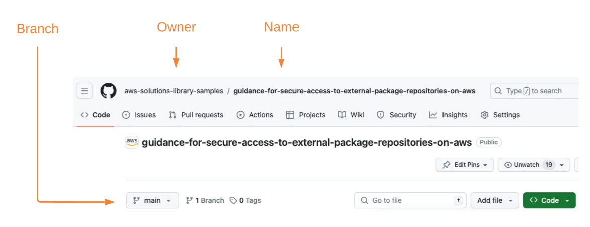<br>
  <span style="display: block; text-align: center;"><em>Figure 3: Private Internal GitHub Repository Configuration</em></span>
</p>

### Deploy AWS CloudFormation Stack

The following section provides instructions for deploying the parameterized [codeartifact-private-repo.yaml](cfn/codeartifact-private-repo.yaml) CloudFormation template into your AWS account using the [create-codeartifact-stack.sh](shell/create-codeartifact-stack.sh) shell script. 

If you are instead using GitHub as your private internal package repository, deploy the solution using the [create-github-stack.sh](shell/create-github-stack.sh) shell script to deploy the [github-private-repo.yaml.yaml](cfn/github-private-repo.yaml) stack.

The CloudFormation stack (`codeartifact-private-repo.yaml`) provisions the following primary resources:
- An AWS CodeArtifact domain and private internal package repository for managing software packages.
- An AWS CodeBuild project that downloads the external package repository using the request file, conducts CodeGuru Security scans on the downloaded external packages, publishes InfoSec-approved external packages to private internal CodeArtifact repository (assuming acceptable severity findings), and notifies requesting data scientist of results.
- An AWS CodePipeline source action to establish GitHub webhook and retrieve filtered source changes.
- An AWS CodePipeline to orchestrate the workflow, integrating source actions, CodeBuild projects, and artifact handling.
- An AWS Secrets Manager secret to store the GitHub token for webhook authentication.
- An Amazon S3 bucket and AWS KMS key to securely store CodePipeline artifacts.
- An Amazon SNS topic and subscription used for email notifications.
- An Amazon Elastic Cloud Compute (EC2) [security group](https://docs.aws.amazon.com/vpc/latest/userguide/vpc-security-groups.html)) for VPC-attached CodeBuild projects.
- An AWS IAM role and two IAM policies:
  - _CodeServicesRole_: IAM role for AWS Code Services (CodePipeline and CodeBuild).
  - _CodeServicesIamPolicy_: IAM policy defining permissions for the Code Services role.
  - _CodeServicesVpcEndpointPolicy_: IAM policy for AWS Code Services VPC Endpoints.

AWS CloudFormation prepopulates stack parameters with the default values provided in the template. To provide alternative input values, you can specify parameters as environment variables that are referenced in the `ParameterKey=<ParameterKey>,ParameterValue=<Value>` pairs in the _aws cloudformation create-stack_ command.

Before deploying the solution, you are required to specify valid name, value, and resource ID environment variables, which will be used to set the corresponding CloudFormation parameters:

```sh
# Provide your own parameter values for AWS region, CloudFormation stack name, CodePipeline pipeline name, and SNS email
export AWS_REGION=<YOUR-STACK-REGION>
export STACK_NAME=<YOUR-STACK-NAME>
export CODEPIPELINE_NAME=<YOUR-CODEPIPELINE-NAME>
export SNS_EMAIL=<YOUR-EMAIL>

# Below parameter values acquired from 'Gather Private Internal Repository Configuration' and 'Create GitHub Personal Access Token' pre-deployment
export PRIVATE_GITHUB_PAT=<YOUR-GITHUB-PAT>
export PRIVATE_GITHUB_BRANCH=<YOUR-PRIVATE-REPOSITORY-BRANCH>
export PRIVATE_GITHUB_OWNER=<YOUR-PRIVATE-REPOSITORY-OWNER>
export PRIVATE_GITHUB_REPO=<YOUR-PRIVATE-REPOSITORY-NAME>

# Below parameter values acquired from 'Configure VPC Networking' pre-deployment
export CODESERVICES_VPC_ID=<YOUR-VPC-ID>
export CODESERVICES_SUBNET_ID1=<YOUR-PRIVATE-SUBNET-ID-1>
export CODESERVICES_SUBNET_ID2=<YOUR-PRIVATE-SUBNET-ID-2>

# (OPTIONAL) Only required with GitHub private package repository, not CodeArtifact
export PRIVATE_GITHUB_USERNAME=<YOUR-GITHUB-USERNAME>
export PRIVATE_GITHUB_EMAIL=<YOUR-GITHUB-EMAIL>
```

Run the _create-codeartifact-stack.sh_ shell script to deploy the solution resources defined in the codeartifact-private-repo.yaml CloudFormation template.

```sh
# cd guidance-for-secure-access-to-external-package-repositories-on-aws/shell/
# chmod u+x create-codeartifact-stack.sh

source ./create-codeartifact-stack.sh

# (OPTIONAL) To deploy the github-private-repo.yaml stack, run the below:
# source ./create-github-stack.sh
```

The preceding ```source ./create-codeartifact-stack.sh``` shell command runs the following AWS CLI commands to deploy the solution stack:

```sh
export UNIQUE_IDENTIFIER=$(uuidgen | tr '[:upper:]' '[:lower:]' | tr -d '-' | cut -c 1-5)
export PRIVATE_GITHUB_TOKEN_SECRET_NAME=$(aws secretsmanager create-secret --name $STACK_NAME-$UNIQUE_IDENTIFIER-git-pat --secret-string $PRIVATE_GITHUB_PAT --region ${AWS_REGION} --query Name --output text)
export ACCOUNT_ID=$(aws sts get-caller-identity --region ${AWS_REGION} --query Account --output text)
export S3_ARTIFACTS_BUCKET_NAME=${STACK_NAME}-${UNIQUE_IDENTIFIER}-codeartifact

aws s3 mb s3://${S3_ARTIFACTS_BUCKET_NAME} --region ${AWS_REGION}

aws cloudformation create-stack \
--stack-name ${STACK_NAME} \
--template-body file://../cfn/codeartifact-private-repo.yaml \
--parameters \
ParameterKey=S3ArtifactsBucket,ParameterValue=${S3_ARTIFACTS_BUCKET_NAME} \
ParameterKey=CodePipelineName,ParameterValue=${CODEPIPELINE_NAME} \
ParameterKey=SNSEmail,ParameterValue=${SNS_EMAIL} \
ParameterKey=PrivateGitHubBranch,ParameterValue=${PRIVATE_GITHUB_BRANCH} \
ParameterKey=PrivateGitHubOwner,ParameterValue=${PRIVATE_GITHUB_OWNER} \
ParameterKey=PrivateGitHubRepo,ParameterValue=${PRIVATE_GITHUB_REPO} \
ParameterKey=PrivateGitHubToken,ParameterValue=${PRIVATE_GITHUB_TOKEN_SECRET_NAME} \
ParameterKey=CodeServicesVpc,ParameterValue=${CODESERVICES_VPC_ID} \
ParameterKey=CodeServicesSubnet,ParameterValue=${CODESERVICES_SUBNET_ID1}\\,${CODESERVICES_SUBNET_ID2} \
--capabilities CAPABILITY_IAM \
--region ${AWS_REGION}

aws cloudformation describe-stacks --stack-name $STACK_NAME --region ${AWS_REGION} --query "Stacks[0].StackStatus"
aws cloudformation wait stack-create-complete --stack-name $STACK_NAME --region ${AWS_REGION}
aws cloudformation describe-stacks --stack-name $STACK_NAME --region ${AWS_REGION} --query "Stacks[0].StackStatus"
```

## Deployment Validation

To monitor the CloudFormation stack deployment status, you can either use the [AWS CloudFormation console](https://console.aws.amazon.com/cloudformation/home?region=us-east-1#/stacks?filteringStatus=active&filteringText=&viewNested=true&hideStacks=false) or run the following commands in your terminal:

```
aws cloudformation describe-stacks --stack-name $STACK_NAME --query "Stacks[0].StackStatus"
aws cloudformation wait stack-create-complete --stack-name $STACK_NAME
```

Upon successful stack deployment, the status transitions from `CREATE_IN_PROGRESS` to `CREATE_COMPLETE`.

## Running the Guidance

We are using a token-based webhook to establish a connection from the private internal GitHub source code repository to CodePipeline. This webhook ensures that POST requests sent to the payload URL originate from your private internal repository. With token authentication configured, you will receive the X-Hub-Signature and X-Hub-Signature-256 headers in the webhook POST request.

With your webhook in place, you are prepared to deploy and launch your SageMaker Studio environment. From there, you will pull the current version of the external-package-request.csv file from your private internal GitHub repository, append the desired additional external package repositories to the request file, then push the updated request file back to the private internal repository. This action triggers CodePipeline execution, enabling scanning of the external package repository for InfoSec approval before making it available as a private internal package.

### Deploy Amazon SageMaker Studio

This section provides an overview of utilizing SageMaker Studio's system terminal to pull, edit, and push file copies between local and remote repositories. Alternatively, you can run your git commands from your local system terminal or another notebook environment.

#### Amazon SageMaker Studio Private Network Architecture

Data scientists authenticate to their [Amazon SageMaker Studio](https://docs.aws.amazon.com/sagemaker/latest/dg/studio.html) domain using [AWS Identity Center](https://docs.aws.amazon.com/singlesignon/latest/userguide/what-is.html) or IAM mode. Each auth-mode maps to the user profile’s associated execution role that defines the user’s maximum permissible notebook actions. SageMaker Studio runs on an environment managed by AWS and allows direct Internet access by default, however, this could provide an additional avenue for unauthorized access or data sharing. To mitigate these risks, you can control your notebook data flows by launching SageMaker Studio in your Amazon Virtual Private Cloud (VPC), where traffic to and from your Studio Domain occurs through an [elastic network interface](https://docs.aws.amazon.com/AWSEC2/latest/UserGuide/using-eni.html) (ENI) in a private VPC subnet.

This solution architecture, depicted in the following [VPC-only deployment pattern](https://docs.aws.amazon.com/sagemaker/latest/dg/studio-notebooks-and-internet-access.html#studio-notebooks-and-internet-access-vpc), enables you to restrict Internet access, monitor and inspect traffic using standard AWS networking and security capabilities (for example, [AWS Network Firewall](https://docs.aws.amazon.com/network-firewall/latest/developerguide/what-is-aws-network-firewall.html)), and connect to other AWS resources through [VPC Endpoints powered by AWS PrivateLink](https://aws.amazon.com/privatelink/). The following diagram highlights the centralized network egress inspection architecture, where NGW is a default route target in the private subnet route table for the Inspection VPC. Internet-bound traffic is inspected using AWS Network Firewall before it is routed to the IGW.

To deploy Amazon SageMaker Studio into a controlled environment with multi-layer security and MLOps pipelines, follow the instructions in the [Amazon SageMaker Secure MLOps Guide](https://github.com/aws-samples/amazon-sagemaker-secure-mlops).

<p align="center">
  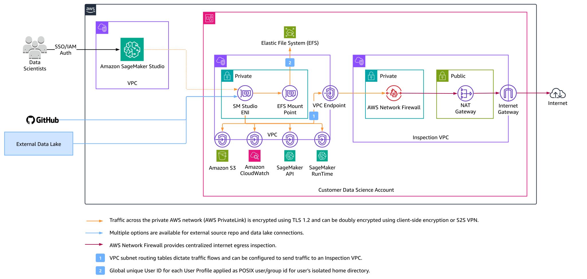<br>
  <span style="display: block; text-align: center;"><em>Figure 4: SageMaker Studio Private Networking Architecture</em></span>
</p>

### Launch Amazon SageMaker Studio

Once Studio is deployed, navigate to the [SageMaker console](https://console.aws.amazon.com/sagemaker/home?#/dashboard), select **Domains** from the menu on the left, then choose your domain.

Under **User profiles**, select your desired user profile, then choose **Studio** from the Launch dropdown to launch your Jupyter Lab environment.

<p align="center">
  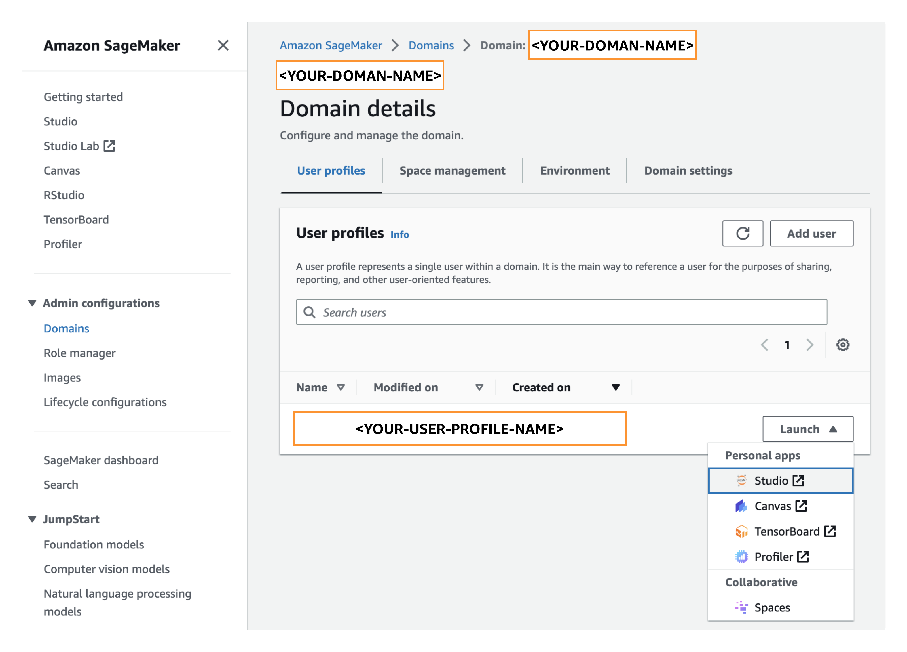<br>
  <span style="display: block; text-align: center;"><em>Figure 5: SageMaker Studio Console</em></span>
</p>

### Initiate Security Review for External Package Submissions

With your GitHub webhook in place, data scientists operating in SageMaker Studio can pull the current version of the external package request file from the private internal GitHub repository, append desired external package repositories to the request file, then push the updated request file back to the private internal repository.

<p align="center">
  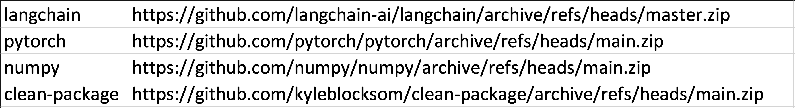<br>
  <span style="display: block; text-align: center;"><em>Figure 6: Original External Package Request File</em></span>
</p>

Retrieve the Zip URL of the external package repository:

<p align="center">
  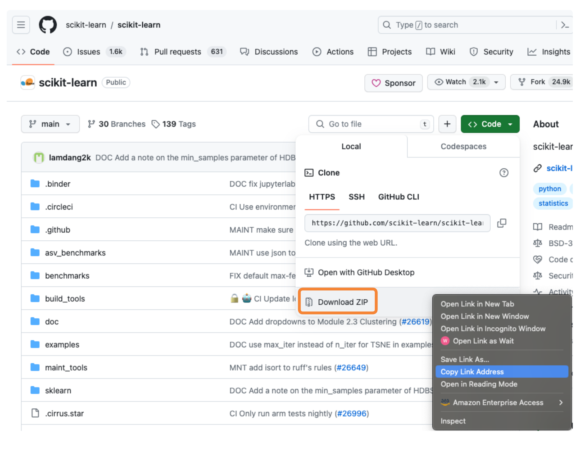<br>
  <span style="display: block; text-align: center;"><em>Figure 7: External Package Repository Zip URL</em></span>
</p>

In SageMaker Studio, open your system terminal:

<p align="center">
  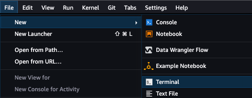<br>
  <span style="display: block; text-align: center;"><em>Figure 8: SageMaker Studio JupyterLab Terminal</em></span>
</p>

To clone your private internal GitHub repository and update the external package request file, run the following commands in your terminal:

```sh
git init
git config --global user.email <YOUR-GITHUB-EMAIL>
git config --global user.name <YOUR-GITHUB-USERNAME>
# If not already forked, fork the remote repository (https://github.com/aws-solutions-library-samples/guidance-for-secure-access-to-external-package-repositories-on-aws.git)
git remote add origin <YOUR-FORKED-REPOSITORY-URL> 
git clone <YOUR-FORKED-REPOSITORY-URL> 
cd <local-repo-name>
git checkout <branch>
vi external-package-request.csv
# Append your external package name and Zip URL to external-package-request-file.csv 
# Example: scikit-learn,https://github.com/scikit-learn/scikit-learn/archive/refs/heads/main.zip
git add external-package-request.csv
git commit -m "Add <PACKAGE-NAME> to external-package-request.csv"
git push -u
```

❗ You will be required to provide your PAT when prompted for your password following the _git push -u_ command.

The updated external package request file should resemble the following:

<p align="center">
  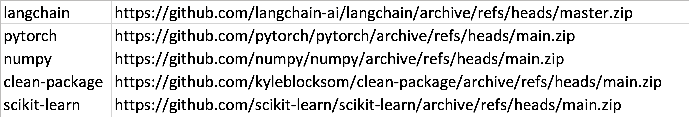<br>
  <span style="display: block; text-align: center;"><em>Figure 9: Updated External Package Request File</em></span>
</p>

## AWS CodePipeline Workflow

The AWS CodePipeline 'Pull_Internal_Repository' source action runs based on the data scientist's commit of the updated external package request file to the private internal GitHub repository, which triggers AWS CodePipeline execution through a webhook secured by a GitHub PAT stored in [AWS Secrets Manager](https://docs.aws.amazon.com/secretsmanager/latest/userguide/intro.html). 

The subsequent 'Download_Scan_Notify_External_Repositories' build stage consists of an AWS CodeBuild project that runs the codeartifact-codeguru-security-scan.py (or github-codeguru-security-scan.py) Python script to parse the external-package-request.csv file, identify the external package repositories to ingest, and then download the external repositories using their Zip URLs.

The external package repository files are stored as AWS CodePipeline artifacts in S3, encrypted using [AWS Key Management Service](https://docs.aws.amazon.com/kms/latest/developerguide/overview.html) (KMS).

You can monitor CodePipeline's execution status from the [CodePipeline console](https://docs.aws.amazon.com/codepipeline/latest/userguide/pipelines-view-console.html#pipelines-executions-status-console):

<p align="center">
  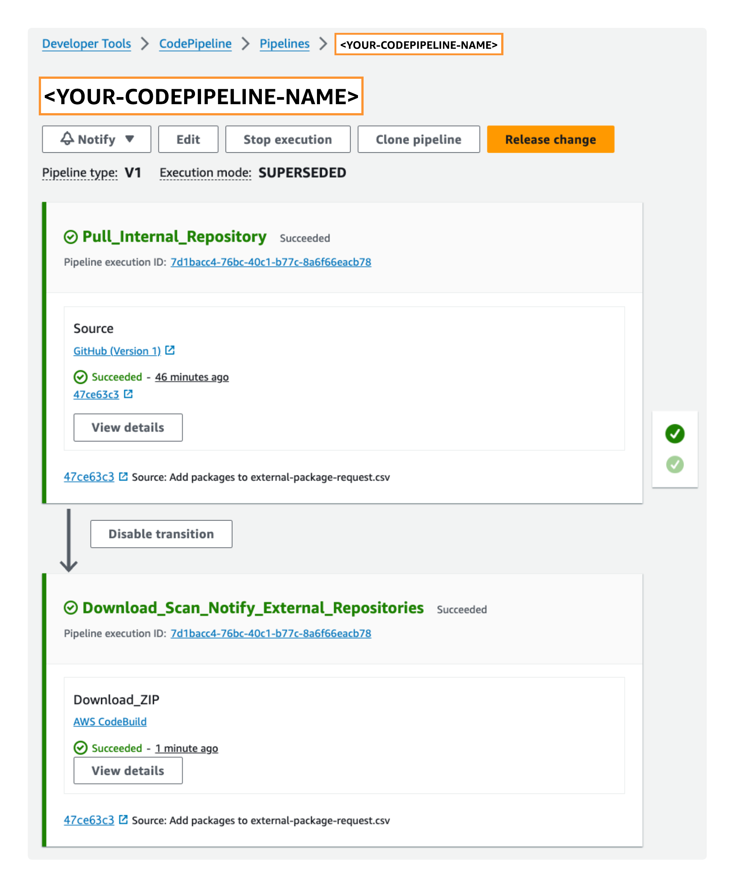<br>
  <span style="display: block; text-align: center;"><em>Figure 10: AWS CodePipeline Execution Status</em></span>
</p>

Select **View details** to view the 'Download_Scan_Notify_External_Repositories' build logs:

<p align="center">
  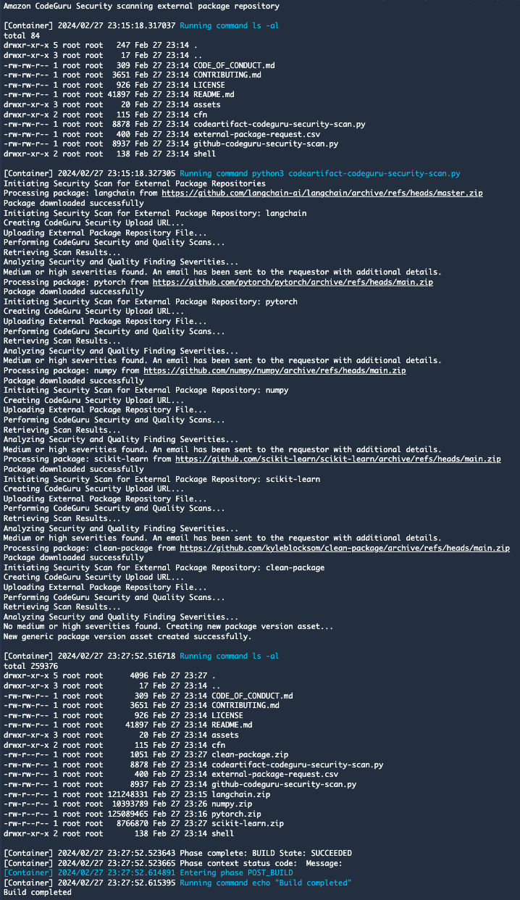<br>
  <span style="display: block; text-align: center;"><em>Figure 11: AWS CodeBuild Build Logs</em></span>
</p>

## Amazon CodeGuru Security Scans

CodeGuru Security conducts security scans on the external package repositories to detect vulnerabilities and return findings. These findings include details about security issues in the external package repository code, the locations of the vulnerabilities in the codebase, and suggestions for remediation. If findings require code changes, CodeGuru Security highlights the vulnerable lines of code and suggests inline fixes. For more information, refer to [Working with findings](https://docs.aws.amazon.com/codeguru/latest/security-ug/working-with-findings.html).

The CodeGuru Security Dashboard offers metrics to monitor the security posture of external package repositories, including open critical findings, severity distribution of findings, and trends over time for each resource. CodeGuru Security tracks the vulnerabilities and trends across multiple revisions of the same resource using the scan name provided during scan creation:

<p align="center">
  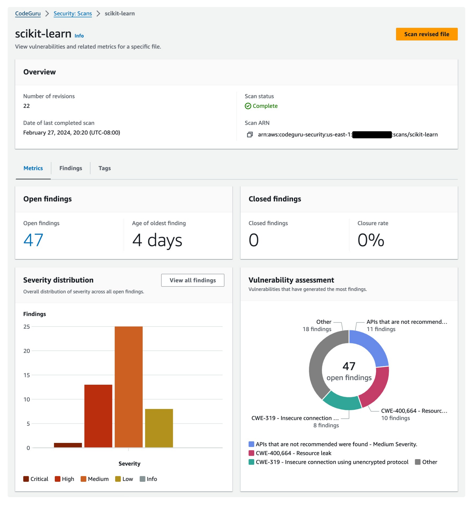<br>
  <span style="display: block; text-align: center;"><em>Figure 11: Amazon CodeGuru Security - Security Scan Findings</em></span>
</p>

For external package security scans with lower than medium severity findings, a new 'Latest' package version is published to the private internal AWS CodeArtifact package repository that was created during the initial solution deployment. However, if any of the finding severities are medium or higher, no private package version is published to AWS CodeArtifact, and instead, Amazon CodeGuru Security findings are shared for further review. In either case, an SNS topic is used to email the results to the requesting data scientist.

The following diagram illustrates the external package security scanning workflow.

<p align="center">
  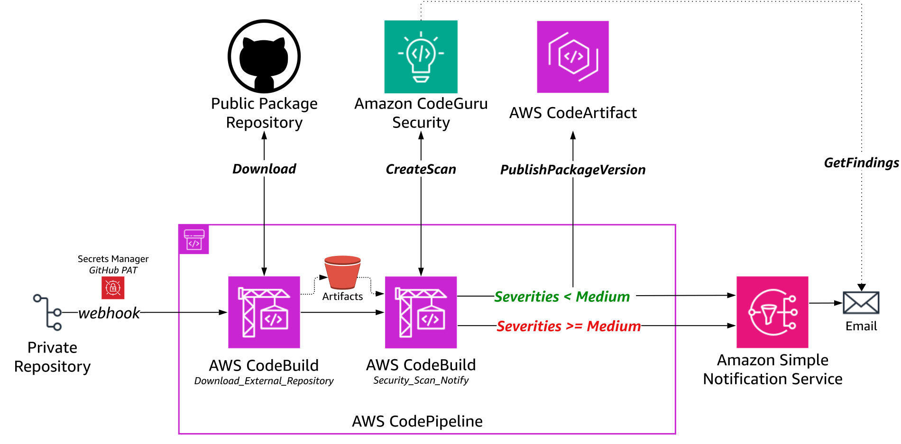<br>
  <span style="display: block; text-align: center;"><em>Figure 12: External Package Security Scanning Workflow</em></span>
</p>

The following is an example InfoSec approval email.

<p align="center">
  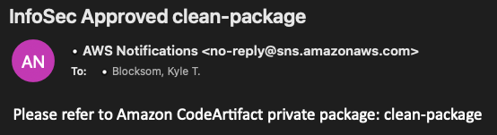<br>
  <span style="display: block; text-align: center;"><em>Figure 13: Amazon SNS Email for AWS CodeArtifact Private Package Name (InfoSec-Approved)</em></span>
</p>

The following is an example InfoSec refusal email.

<p align="center">
  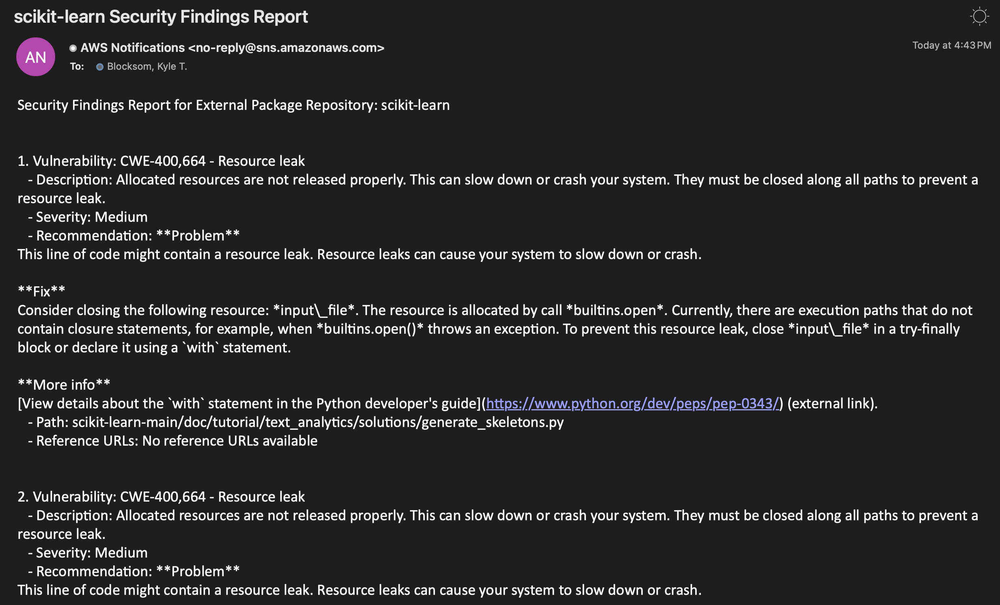<br>
  <span style="display: block; text-align: center;"><em>Figure 14: Amazon SNS Email with Amazon CodeGuru Security Findings (InfoSec-Refused)</em></span>
</p>

### Utilizing InfoSec-Approved Private Internal Package Repository with SageMaker Studio Notebook

To view the packages published to the CodeArtifact private internal package repository, navigate to the [AWS CodeArtifact Console](https://us-east-1.console.aws.amazon.com/codesuite/codeartifact/start?region=us-east-1):

<p align="center">
  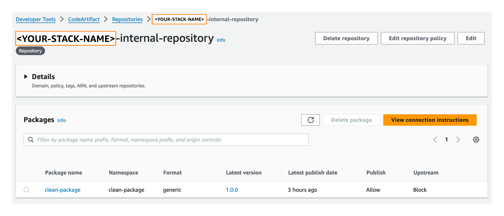<br>
  <span style="display: block; text-align: center;"><em>Figure 15: AWS CodeArtifact Console</em></span>
</p>

Assuming the data scientist's external package repositories have InfoSec approval, users can use their SageMaker Studio Notebook to download the approved external packages using the newly-created private internal repository package. To download the CodeArtifact private internal package version asset to your SageMaker Studio environment, use the [_aws codeartifact get-package-version-asset_](https://awscli.amazonaws.com/v2/documentation/api/latest/reference/codeartifact/get-package-version-asset.html) CLI command and refer to [Download package version assets](https://docs.aws.amazon.com/codeartifact/latest/ug/download-assets.html) for additional details:

```sh
aws codeartifact get-package-version-asset --domain <YOUR-CODEARTIFACT-DOMAIN> \
--repository <YOUR-CODEARTIFACT-PRIVATE-PACKAGE-REPOSITORY> --format generic --namespace <YOUR-CODEARTIFACT-NAMESPACE> \
--package <YOUR-PACKAGE-NAME> --package-version Latest --asset <YOUR-UNIQUE-PACKAGE-VERSION-ASSET>.zip <YOUR-LOCAL-FILE-NAME>.zip 
```

<p align="center">
  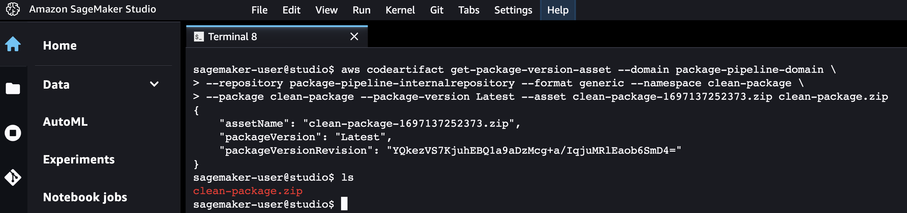<br>
  <span style="display: block; text-align: center;"><em>Figure 16: AWS CodeArtifact Private Package Version Asset Download</em></span>
</p>

❗This solution also supports GitHub as the private internal package repository. Data scientists' notebooks will follow the pattern of installing InfoSec-approved external packages using the private internal repository endpoint (for example, _pip install git+https://github.com/customer-org/new-repo.git)_. View the GitHub solution architecture at [assets/images/github-overview.svg](assets/images/github-overview.svg).

## Next Steps

This Guidance provided a functional overview of a solution that orchestrates the intake and security scanning of external package repositories before their use in data scientists’ notebooks. With a strong security mindset early in their development processes, data scientists are now free to implement their solutions without concerns of a pre-production security scan restarting their development lifecycle. This solution empowers data scientists to take ownership of security by “shifting left” the feedback and accountability for secure open-source library selection to them. Now, in a story of collaboration rather than competing priorities, data science and InfoSec teams are mitigating known threats and preventing future risks from being introduced through code supply chain. 

To test and validate the solution in your own secure data science environment, deploy the solution from this source code GitHub repository into your AWS account and experiment with your own SageMaker Studio Notebooks and other developer workflows.

## Clean Up

To avoid charges in your AWS account, clean up provisioned resources.

### Step 1: Revoke GitHub Personal Access Token

GitHub PATs are configured with an expiration value. To prevent your PAT from being used for programmatic access to your private internal GitHub repository before it reaches its expiry, revoke the PAT by following [GitHub's instructions](https://docs.github.com/en/organizations/managing-programmatic-access-to-your-organization/reviewing-and-revoking-personal-access-tokens-in-your-organization).

### Step 2: Clean Up AWS SageMaker Studio MLOps Projects

AWS SageMaker Studio projects and corresponding Amazon S3 buckets with project and pipeline artifacts will incur a cost in your AWS account. To delete your SageMaker Studio Domain and corresponding applications, notebooks, and data, following the instructions in the [SageMaker Developer Guide](https://docs.aws.amazon.com/sagemaker/latest/dg/gs-studio-delete-domain.html).

### Step 3: Delete the CloudFormation Stack
If you used CodeArtifact as your private internal package repository, use ```./delete-codeartifact-stack.sh``` to delete your solution stack.
If you used GitHub as your private internal package repository, use ```./delete-github-stack.sh``` to delete your solution stack.

The preceding ```source ./delete-codeartifact-stack.sh``` shell command needs to be run from the same working directory in which you deployed the solution stack so that it can reference the appropriate environment variables set during the solution deployment. The shell script runs the following AWS CLI commands to delete the solution stack:

```sh
echo "Emptying and Deleting S3 Bucket: $S3_ARTIFACTS_BUCKET_NAME"
aws s3 rm s3://${S3_ARTIFACTS_BUCKET_NAME} --recursive
aws s3 rb s3://${S3_ARTIFACTS_BUCKET_NAME}

SECURITY_GROUP_ID=$(aws cloudformation describe-stack-resources --stack-name $STACK_NAME --logical-resource-id CodeBuildSecurityGroup --query "StackResources[0].PhysicalResourceId" --output text)
echo "Deleting Security Group ID: $SECURITY_GROUP_ID"
aws ec2 delete-security-group --group-id $SECURITY_GROUP_ID

echo "Deleting CloudFormation Stack: $STACK_NAME"
aws cloudformation delete-stack --stack-name $STACK_NAME
aws cloudformation wait stack-delete-complete --stack-name $STACK_NAME

echo "Deleting Secrets Manager Secret: $GITHUB_TOKEN_SECRET_NAME"
aws secretsmanager delete-secret --secret-id $GITHUB_TOKEN_SECRET_NAME
```

## Disclaimer

*Customers are responsible for making their own independent assessment of the information in this Guidance. This Guidance: (a) is for informational purposes only, (b) represents AWS current product offerings and practices, which are subject to change without notice, and (c) does not create any commitments or assurances from AWS and its affiliates, suppliers or licensors. AWS products or services are provided “as is” without warranties, representations, or conditions of any kind, whether express or implied. AWS responsibilities and liabilities to its customers are controlled by AWS agreements, and this Guidance is not part of, nor does it modify, any agreement between AWS and its customers.*

## Authors

Kyle T. Blocksom, AWS Sr. Solutions Architect
